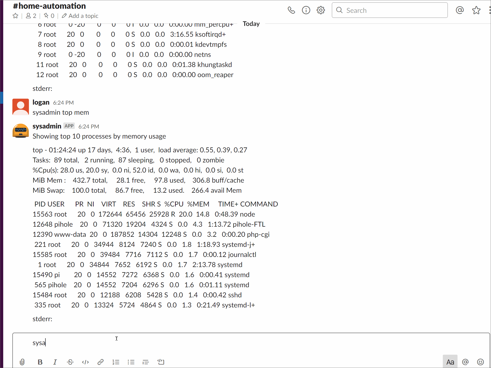

# hubot-sysadmin

hubot-sysadmin is a chat bot built on the [Hubot][hubot] framework. It was
initially generated by [generator-hubot][generator-hubot]. It is designed to run
on Raspberry Pis, especially those with [pihole][pihole] configured.  In this way,
you can do various sysadmin tasks via simply chatting with a configured Slack
channel and your hubot user!  

**ChatOps > SSH** (for simple stuff).

[pihole]: https://pi-hole.net/
[hubot]: http://hubot.github.com
[generator-hubot]: https://github.com/github/generator-hubot

### Example Usage

## Setup

TODO - make this reader friendly.

Install Slack, set up a workspace, get a Bot user, Get a legacy Api Token.

Install hubot-sysadmin on your raspberry pi.

Add the service to systemd

### Adding your own scripts

Basically following along with `/scripts/example.coffee`, you can make your own
little tasks.

For many common tasks, there's a good chance someone has already one to do just
the thing. Check out the [docs][scripting-docs] and already made [scripts][scripts].

[scripting-docs]: https://github.com/github/hubot/blob/master/docs/scripting.md
[scripts]: https://github.com/hubot-scripts

## Setting up with Slack

Hubot sysadmin uses the slack adapter, so will require a slack API key.  This is currently
only supported under the [legacy API token][legacy], which will allegedly die soon.  Git em while they're
hot!

[bot-users]: https://api.slack.com/legacy/custom-integrations/bot-users
[legacy]: https://api.slack.com/legacy/custom-integrations/legacy-tokens
[hubot-adapters]: https://github.com/github/hubot/blob/master/docs/adapters.md

